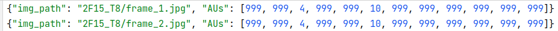
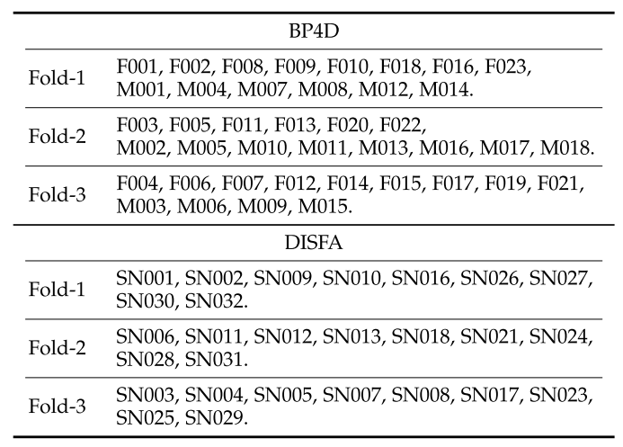
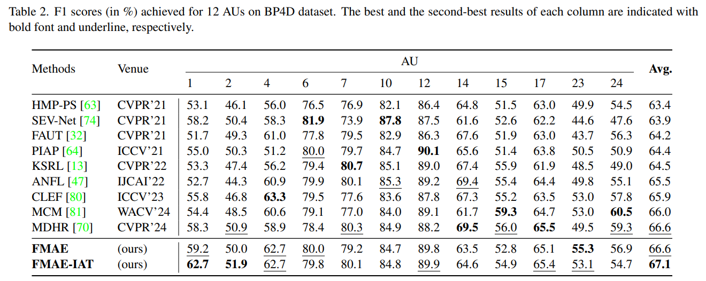
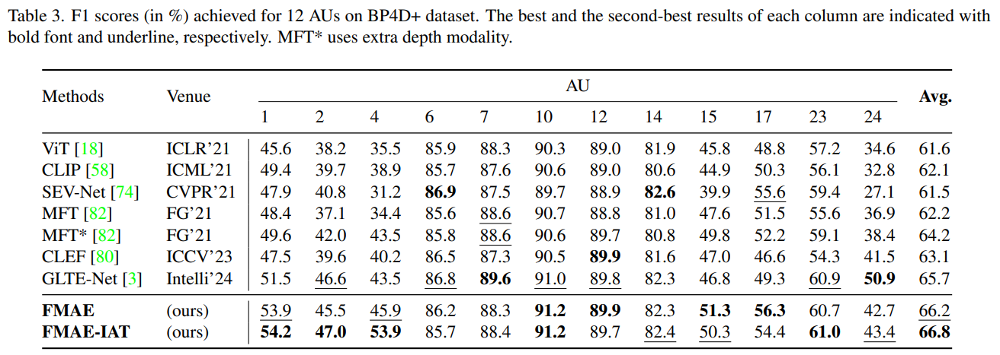
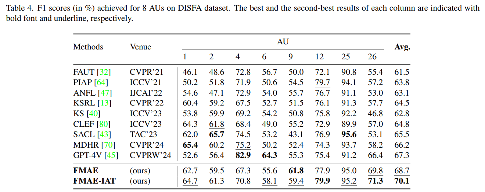
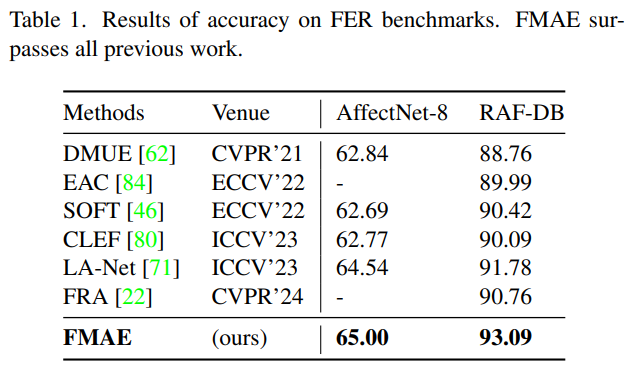

## FMAE-IAT
[](https://paperswithcode.com/sota/facial-action-unit-detection-on-bp4d?p=representation-learning-and-identity)
[](https://paperswithcode.com/sota/facial-action-unit-detection-on-bp4d-1?p=representation-learning-and-identity)
[](https://paperswithcode.com/sota/facial-action-unit-detection-on-disfa?p=representation-learning-and-identity)
[](https://paperswithcode.com/sota/facial-expression-recognition-on-raf-db?p=representation-learning-and-identity)
[](https://paperswithcode.com/sota/facial-expression-recognition-on-affectnet?p=representation-learning-and-identity)


This is the codebase for our paper **Representation Learning and Identity Adversarial Training for Facial Behavior
Understanding**

```
@misc{ning2024representation,
    title={Representation Learning and Identity Adversarial Training for Facial Behavior Understanding},
    author={Mang Ning and Albert Ali Salah and Itir Onal Ertugrul},
    year={2024},
    eprint={2407.11243},
    archivePrefix={arXiv},
    primaryClass={cs.CV}
}
```

The code has been tested on A100 GPU.

### Installation
for AU finetune and pretraining, we use pytorch 1.8.0
```shell
conda craete -n mae python==3.8
conda activate mae
conda install pytorch==1.8.0 torchvision==0.9.0 torchaudio==0.8.0 cudatoolkit=11.1 -c pytorch -c conda-forge
pip install timm==0.3.2
pip install tensorboard
pip install lmdb
pip install scikit-learn
```

for ID linear probing, we use pytorch 1.11.0 (1.8.0 has an issue with AdamW when freezing some layers)
```shell
conda craete -n mae_lb python==3.9
conda activate mae_lb
conda install pytorch==1.11.0 torchvision==0.12.0 torchaudio==0.11.0 cudatoolkit=11.3 -c pytorch
pip install timm==0.3.2
pip install tensorboard
pip install lmdb
pip install scikit-learn
```

* This repo is based on [`timm==0.3.2`](https://github.com/rwightman/pytorch-image-models), for which a [fix](https://github.com/rwightman/pytorch-image-models/issues/420#issuecomment-776459842) is needed to work with PyTorch 1.8.1+.

### Catalog

- [x] FMAE pretraining by MAE
- [x] Finetune FMAE and FMAE-IAT on AU benchmarks 
  - [x] BP4D
  - [x] BP4D+
  - [x] DISFA
- [x] Finetune FMAE on FER benchmarks
- [x] ID linear probing


### FMAE pretraining
To use code, checkout to branch `mae_pretraining`

The following table provides the pre-trained checkpoints used in the paper

| FMAE            | ViT-large                                                                                      | ViT-base                                                                                       | ViT-small                                                                                      |
|-----------------|------------------------------------------------------------------------------------------------|------------------------------------------------------------------------------------------------|------------------------------------------------------------------------------------------------|
| pretrained ckpt | [download](https://drive.google.com/file/d/1xccb4O5cXeq2zO5_Ec1Ybz-VLO4PAwRr/view?usp=sharing) | [download](https://drive.google.com/file/d/1uCdJq4xQAbYQHTVpcflrnK8OPavJ8Fz7/view?usp=sharing) | [download](https://drive.google.com/file/d/1p1hJd9ks3U6tg3N1rlEmDyuUNXoRbATJ/view?usp=sharing) |

The pretraining settings are:

**ViT-small** (use --resume if necessary)
```shell
python submitit_pretrain.py \
--job_dir exp_mae_pretrain_vit-S --nodes 1 --ngpus 2 \
--batch_size 256 --epochs 50 --warmup_epochs 2 \
--model mae_vit_small_patch16 --data_path YOUR_DATASET_PATH \
--norm_pix_loss --mask_ratio 0.75 --blr 1.5e-4 --weight_decay 0.05 \
--resume RESUME_CKPT --start_epoch RESUME_EPOCH \
```


**ViT-base**
```shell
python submitit_pretrain.py \
--job_dir exp_mae_pretrain --nodes 1 --ngpus 2 \
--batch_size 256 --epochs 50 --warmup_epochs 2 \
--model mae_vit_base_patch16 --data_path YOUR_DATASET_PATH \
--norm_pix_loss --mask_ratio 0.75 --blr 1.5e-4 --weight_decay 0.05 \
```

**ViT-large**
```shell
python submitit_pretrain.py \
--job_dir exp_mae_pretrain_vit-L --nodes 1 --ngpus 4 \
--batch_size 128 --epochs 50 --warmup_epochs 2 \
--model mae_vit_large_patch16 --data_path YOUR_DATASET_PATH \
--norm_pix_loss --mask_ratio 0.75 --blr 1.5e-4 --weight_decay 0.05 \
```


## Finetune FMAE and FMAE-IAT on AU benchmarks

You can downlaod our ViT-large model for finetune FMAE or FMAE-IAT on AU datasets.

We use json file to contain the AU labels. ID labels are inclueded in the image filename and would be automatically extracted.
A template json label looks like (999 stands for the non-existance of this AU):
<p align="left">
  
</p>

For reproducibility, you can directly **download all AU label json files that we have processed**
[download json](https://drive.google.com/drive/folders/1V5QMB2NouhP_Sw7BwiKs3Eaf-PMItMda?usp=sharing)

For reproducibility, we set random seeds (use 0/1/2) for all experiments and share our cross-fold settings.

### BP4D
To use code, checkout to branch `BP4D_finetune_or_ID_adversarial`


Our subject partitions of BP4D and DISFA follow the paper 'Multi-scale Promoted Self-adjusting Correlation Learning for Facial Action Unit Detection'
<p align="left">
  
</p>


finetune FMAE
```shell
python BP4D_finetune.py --seed 0/1/2 --grad_reverse 0 --save_ckpt False \
--blr 0.0002 --batch_size 64 --epochs 20 --warmup_epochs 2 --nb_classes 12 --nb_subjects 41 \
--model vit_large_patch16 --finetune (ViT-large_ckpt) \
--root_path BP4D_DATASET \
--train_path FOLD_1_TRAIN_JSON \
--test_path FOLD_1_TEST_JSON \
--output_dir ./exp_BP4D_finetune_vit_L --log_dir ./exp_BP4D_finetune_vit_L
```


finetune FMAE-IAT (lambda=2)
```shell
python BP4D_finetune.py --seed 0/1/2 --grad_reverse 2 \
--blr 0.0005 --batch_size 64 --epochs 30 --warmup_epochs 3 --nb_classes 12 --nb_subjects 41 \
--model vit_large_patch16 --finetune (ViT-large_ckpt) \
--root_path BP4D_DATASET \
--train_path FOLD_1_TRAIN_JSON \
--test_path FOLD_1_TEST_JSON \
--output_dir ./exp_BP4D_ID_adversarial_ckpt32 --log_dir ./exp_BP4D_ID_adversarial_ckpt32
```


results



### BP4D+

To use code, checkout to branch `BP4D_finetune_or_ID_adversarial`

we randomly split the subjects into 4 folds, 3 folds used for training and 1 for testing.

|        |                                                                                                                                       BP4D+ subjects                                                                                                                                      |
|--------|:-----------------------------------------------------------------------------------------------------------------------------------------------------------------------------------------------------------------------------------------------------------------------------------------:|
| fold-1 | 'M040', 'F072', 'M015', 'M029', 'M003', 'F076', 'F053', 'F026', 'F044', 'F066',  'F057', 'F061', 'F071', 'M050', 'M033', 'F079', 'F020', 'M025', 'F014', 'F004',  'F013', 'M017', 'F033', 'M042', 'M004', 'F038', 'F019', 'M036', 'M026', 'M048',  'F039', 'F046', 'M051', 'F047', 'M020' |
| fold-2 | 'F074', 'F012', 'F034', 'M001', 'F056', 'F075', 'M009', 'M038', 'F024', 'M047',  'F016', 'M045', 'M034', 'M022', 'F060', 'M011', 'M044', 'M046', 'M005', 'M028',  'F077', 'F028', 'M055', 'M019', 'F032', 'F030', 'M037', 'M043', 'F031', 'F022',  'M023', 'M018', 'M016', 'F065', 'M052' |
| fold-3 | 'F029', 'F054', 'F064', 'F045', 'F009', 'F040', 'F008', 'M041', 'F063', 'M056', 'M024', 'F001', 'F080', 'M010', 'F062', 'F035', 'M054', 'F052', 'F027', 'F043',  'F042', 'F050', 'M057', 'F078', 'F058', 'F017', 'M035', 'M030', 'M027', 'F021',  'M031', 'F069', 'F002', 'M008', 'F068'  |
| fold-4 | 'M058', 'F037', 'F010', 'F023', 'M007', 'M002', 'F025', 'F073', 'F048', 'F041',  'F051', 'F011', 'M032', 'F005', 'M021', 'F018', 'M013', 'M049', 'M014', 'F070',  'F006', 'F067', 'M039', 'M006', 'F059', 'F003', 'F007', 'F049', 'M053', 'F081',  'F055', 'M012', 'F082', 'F015', 'F036' |


finetune FMAE
```shell
python BP4D_plus_finetune.py --seed 0/1/2 --grad_reverse 0 \
--blr 0.0005 --batch_size 64 --epochs 20 --warmup_epochs 2 --nb_classes 12 --nb_subjects 140 \
--model vit_large_patch16 --finetune (ViT-large_ckpt) \
--root_path BP4D+_DATASET \
--train_path FOLD_1_TRAIN_JSON \
--test_path FOLD_1_TEST_JSON \
--output_dir ./exp_BP4D_plus_finetune_vit_L --log_dir ./exp_BP4D_plus_finetune_vit_L
```


finetune FMAE-IAT (lambda=1)
```shell
python BP4D_plus_finetune.py --seed 0/1/2 --grad_reverse 1 \
--blr 0.0005 --batch_size 64 --epochs 30 --warmup_epochs 3 --nb_classes 12 --nb_subjects 140 \
--model vit_large_patch16 --finetune (ViT-large_ckpt) \
--root_path BP4D+_DATASET \
--train_path FOLD_1_TRAIN_JSON \
--test_path FOLD_1_TEST_JSON \
--output_dir ./exp_BP4D_plus_ID_adversarial --log_dir ./exp_BP4D_plus_ID_adversarial
```

results



### DISFA
To use code, checkout to branch `DISFA_finetune_or_ID_adversarial`


finetune FMAE
```shell
python DISFA_finetune.py --seed 0/1/2 --grad_reverse 0 \
--blr 0.0005 --batch_size 64 --epochs 20 --warmup_epochs 2 --nb_classes 8 --nb_subjects 27 \
--model vit_large_patch16 --finetune (ViT-large_ckpt) \
--root_path DISFA_DATASET \
--train_path FOLD_1_TRAIN_JSON \
--test_path FOLD_1_TEST_JSON \
--output_dir ./exp_DISFA_finetune_vit_L --log_dir ./exp_DISFA_finetune_vit_L
```

finetune FMAE-IAT (lambda=0.5)
```shell
python DISFA_finetune.py --seed 0/1/2 --grad_reverse 0.5 \
--blr 0.0005 --batch_size 64 --epochs 20 --warmup_epochs 2 --nb_classes 8 --nb_subjects 27 \
--model vit_large_patch16 --finetune (ViT-large_ckpt) \
--root_path DISFA_DATASET \
--train_path FOLD_1_TRAIN_JSON \
--test_path FOLD_1_TEST_JSON \
--output_dir ./exp_DISFA_finetune_adversarial --log_dir ./exp_DISFA_finetune_adversarial
```

results



## Finetune FMAE on FER benchmarks


### RAF-DB

To use code, checkout to branch `RAFDB_finetune`

finetune FMAE
```shell
python RAFDB_finetune.py --seed 0/1/2 --blr 0.001 --nb_classes 7 \
--batch_size 32 --epochs 60 --warmup_epochs 6 \
--model vit_large_patch16 --finetune (ViT-large_ckpt) \
--train_path TRAIN_IMG_FOLDER \
--test_path TEST_IMG_FOLDER \
--output_dir ./exp_RAFDB_finetune_vit_L --log_dir ./exp_RAFDB_finetune_vit_L
```


### AffectNet-8
To use code, checkout to branch `AffectNet_finetune`

finetune FMAE
```shell
python AffectNet_finetune.py --seed 0/1/2  --nb_classes 8 \
--blr 0.0005 --batch_size 64 --accum_iter 1 --epochs 30 --warmup_epochs 3 \
--model vit_large_patch16 --finetune (ViT-large_ckpt) \
--train_path TRAIN_IMG_FOLDER \
--test_path TEST_IMG_FOLDER \
--output_dir ./exp_AffectNet8_finetune_vit_L --log_dir ./exp_AffectNet8_finetune_vit_L
```

<p align="left">
  
</p>


## Identity Linear probing
To use code, checkout to branch `BP4D_ID_linear_prob`

After training your FMAE/FMAE-IAT model and saved its ckpt, use the ckpt for identity linear probing.

linear probing of FMAE/FMAE-IAT on BP4D

```shell
python BP4D_finetune.py --seed 0 --nb_classes 41 \
--blr 0.0002 --batch_size 64 --epochs 20 --warmup_epochs 2 \
--model vit_large_patch16 --finetune YOUR FMAE/FMAE-IAT CKPT \
--root_path BP4D_DATASET \
--train_path LINEAR_PROB_TRAIN_JSON \
--test_path LINEAR_PROB_TEST_JSON \
--output_dir ./exp_BP4D_linear_prob --log_dir ./exp_BP4D_linear_prob
```